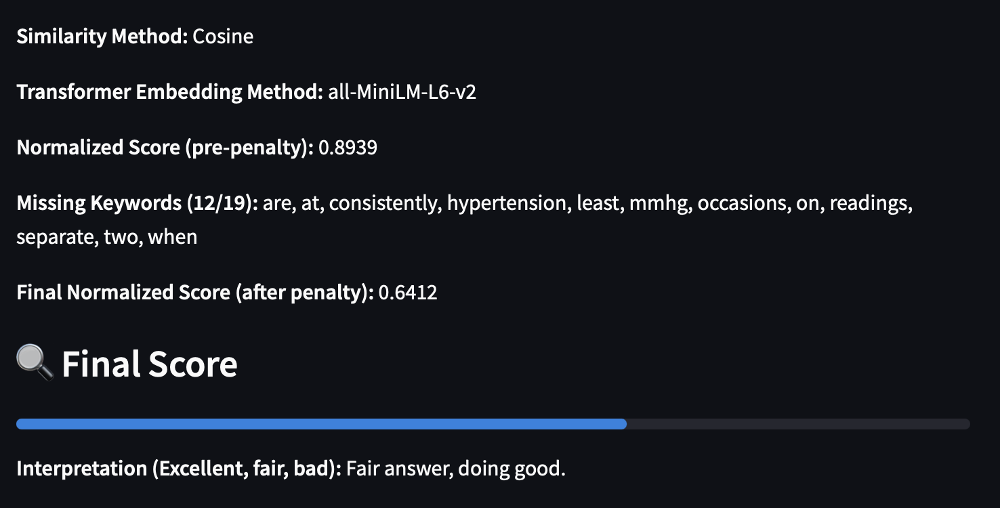
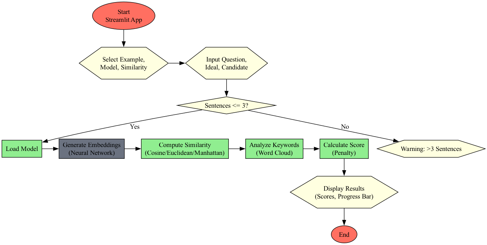

# Grading model for the American Board of Anesthesiology

Scenario: You are working for a medical certification board exploring the use of short-answer questions for continuing certification exams. You are asked to build a prototype grading model that can automatically score short, free-text responses (1-3 sentences) given a reference “ideal” answer.
Objective: Please share and explain your approach to reach the goal.

## How to run
To run the Automated Grading Prototype, download the code from the GitHub repo, ensure you have all required Python packages installed (e.g., streamlit, sentence-transformers, scikit-learn, etc.), and then simply execute the included Bash script. To do this, open a terminal, navigate to the project directory, and run ./prototype_runner.sh. This script launches the prototype_app.py Streamlit application, which provides a web interface for grading short free-text answers using sentence embeddings and similarity metrics. Make sure the script has execute permissions (chmod +x prototype_runner.sh) before running it. Once you run the application, there may be a few seconds of delay until the application is completely rendered. In this, you will see on the top right corner, a sign, that reads "RUNNING". Please wait until the application fully rendered.

## Approach
In our approach, we use sentence embeddings to convert both the ideal answer and the candidate's response into fixed-length numerical vectors using a pre-trained transformer model. These embeddings capture the semantic meaning of the sentences beyond just surface-level word matching. Once we have these vector representations, we compute similarity scores between them using metrics such as cosine similarity, Euclidean distance, or Manhattan distance. Cosine similarity measures the angle between the two vectors, highlighting directional similarity, while the distance-based metrics quantify how far apart the vectors are in space. These similarity scores are then scaled and converted into a [0,1] grading score, offering an interpretable and automated way to evaluate the semantic closeness between a candidate's response and the expected answer.

## Transformer models
This project leverages transformer-based sentence embedding models to evaluate the semantic similarity between a candidate response and an ideal medical answer. It supports general-purpose models such as all-MiniLM-L6-v2, all-MiniLM-L12-v2, and paraphrase-MiniLM-L6-v2, all of which are lightweight yet powerful variants of Sentence-BERT fine-tuned for tasks like paraphrase detection and semantic textual similarity. Additionally, it includes two domain-specific models— BioBERT (pritamdeka/BioBERT-mnli-snli-scinli-scitail-mednli-stsb) and PubMedBERT (pritamdeka/S-PubMedBERT-MS-MARCO)—which are pre-trained and fine-tuned on biomedical and clinical corpora, making them well-suited for medical language understanding. All models generate fixed-length sentence embeddings using mean pooling, and similarity scores between candidate and reference answers are calculated using cosine similarity, Euclidean distance, or Manhattan distance for robust evaluation.

## Example output
**Question**: What criteria are used to diagnose hypertension?

**Ideal answer**: Hypertension is diagnosed when blood pressure readings are consistently above 130/80 mmHg on at least two separate occasions.

**Candidate response**: High blood pressure is diagnosed if it stays above 130 over 80 multiple times.

Model output:

## Flowchart of the prototype

## File structure
<pre><code>
grading_model/ 
.
├── README.md
├── example_output.png
├── flowchart.dot
├── flowchart.png
├── prototype_app.py
├── prototype_runner.sh
├── requirements.txt
├── sample_QA.txt
└── structure.txt

</code></pre>

## List of demo functionalities
- Compares a candidate answer with a given ideal answer
- Provides a normalized score, in [0,1], for measuring similarity of the answers
- Outputs words in candidate answers that are missing, according to comparison with the ideal answer 
- Gives feedback through a visualized bar
- Categorizes quality of candidate answers into three groups of excellent, fair, and poor.

## Limitations and future work
The current embedding models utilized in this prototype have not been clinically validated against state-of-the-art medical datasets, and therefore should not be considered as substitutes for expert judgment or regulatory-grade tools. Future work will focus on rigorous clinical validation of the models using curated, domain-specific benchmarks. Additionally, incorporating expert-labeled data and establishing a human-in-the-loop scoring feedback mechanism with domain professionals will be essential to improve reliability, interpretability, and alignment with real-world clinical standards.

## Citations:

### Embedding transformer models
BioBERT: https://huggingface.co/pritamdeka/BioBERT-mnli-snli-scinli-scitail-mednli-stsb 
PubMedBERT: https://huggingface.co/pritamdeka/S-PubMedBert-MS-MARCO 
MiniLM-L6: https://huggingface.co/sentence-transformers/all-MiniLM-L6-v2 
MiniLM-L12: https://huggingface.co/sentence-transformers/all-MiniLM-L12-v2 
paraphrase-MiniLM-L6: https://huggingface.co/sentence-transformers/paraphrase-MiniLM-L6-v2
